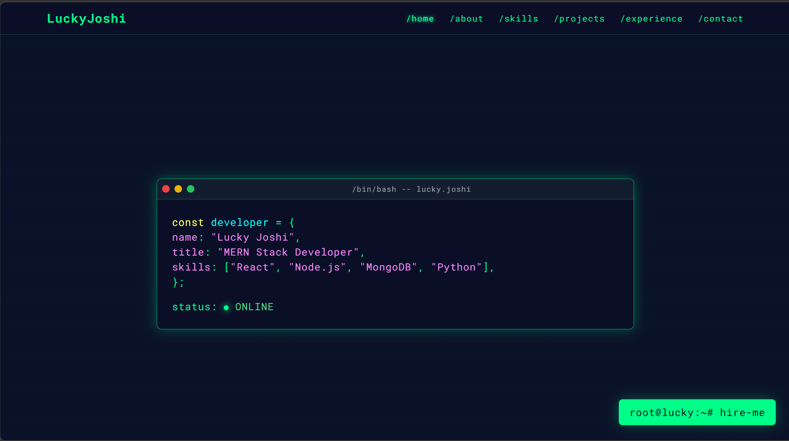

# Lucky Joshi – Frontend Developer Portfolio

A modern and responsive portfolio website to showcase my skills, projects, and experience as a frontend developer.

## 📸 Preview




## 🚀 Features

- Clean UI with Tailwind CSS
- Dark/Light Mode toggle
- Smooth scroll animations
- Animated role text (Typed.js)
- Stats counter on scroll (CountUp.js)
- Responsive layout for all devices
- Resume download & contact section

## 💻 Tech Stack

- React 19 (JSX components)
- Vite (dev server & production build)
- Tailwind CSS
- AOS (Animate on Scroll)
- JavaScript (ES6+)

## 🛠️ Local Development

```bash
npm install
npm run dev      # start dev server
npm run build    # production build to dist/
npm run preview  # preview the production build
```

Static assets (`resume.html`, images, `manifest.json`, `robots.txt`, `sitemap.xml`, `_headers`) are copied to `dist/` unchanged during the build.

## 🔗 Live Demo

👉 [Visit Portfolio](https://luckyjoshiportfoliopage.netlify.app)

## 📄 License

This project is open source under the [MIT License](https://opensource.org/licenses/MIT).
